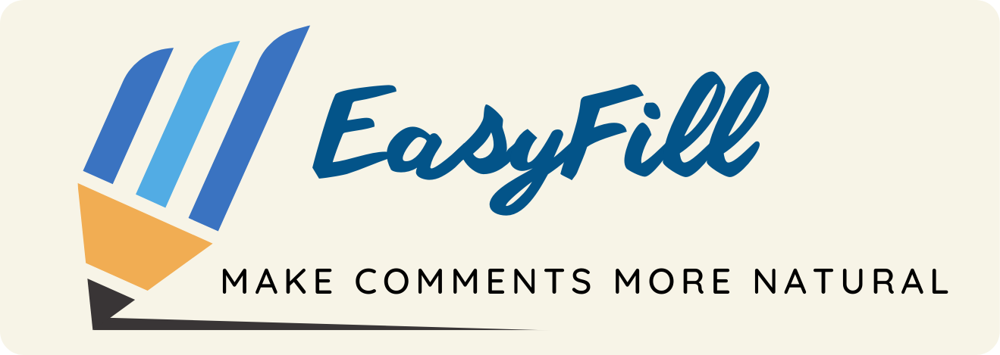

<h1 align="center">
  
  EasyFill
</h1>

  
  
  
  

  
    
  
    
  <q><i>简易填充，让每一次评论更自然，与你的博友互动无缝连接</i></q>

  <a href="" target="_blank">Install</a>
  &bull;
  <a href="https://github.com/achuanya/EasyFill/blob/main/UpdateLog.md" target="_blank">Update Log</a>
  &bull;
  <a href="" target="_blank">Bug Submission</a>

